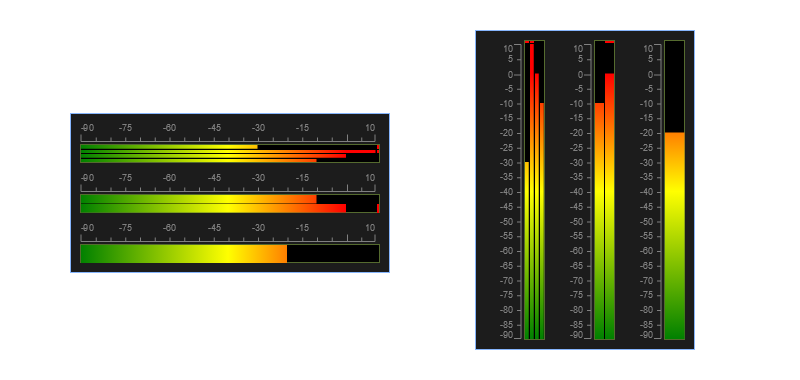

## LevelMeter Usage



**Features**

- Multiple channels
- Peak indicator
- Click event supported
- Auto-adaptive ruler
- Both horizontal an vertical layouts are supported

### Example

```slint
import { LevelMeter } from "./slintcomponents/lib.slint";

export component EgLevelMeterH inherits VerticalLayout {
    padding: 10px;
    spacing: 10px;
    width: 320px;
    LevelMeter {
        orientation: horizontal;
        height: 40px;
    }
    LevelMeter {
        orientation: horizontal;
        height: 40px;
        levels: [-10, 0];
        peak-hold: [false, true];
    }
    LevelMeter {
        orientation: horizontal;
        height: 40px;
        levels: [-20];
        peak-hold: [false];
    }
}

export component EgLevelMeterV inherits HorizontalLayout {
    padding: 10px;
    spacing: 10px;
    height: 320px;
    LevelMeter {
        orientation: vertical;
        width: 60px;
    }
    LevelMeter {
        orientation: vertical;
        width: 60px;
        levels: [-10, 0];
        peak-hold: [false, true];
    }
    LevelMeter {
        orientation: vertical;
        width: 60px;
        levels: [-20];
        peak-hold: [false];
    }
}
```

### References

#### Dynamic properties

##### **in** property <*[float]*> **levels**

Current values of each channels

example: `levels: [-30.0, 20.0, 0.0, -10.0];`

##### **in** property <*float*> **max-level**

Maximum measurement range.

example `max-level: 10.0;`

##### **in** property <*float*> **min-level**

Minimum measurement range.

example `min-level: -90.0;`

##### **in** property <*float*> **peak**

Indicates where the peak point is within the measurement range. The peak point is only related to the color indication of the bar and the mark on the ruler. As long as the measurement range allows, the meter could show values greater than the peak value.

Also, the peak indicator should be set by your program using the status. This property is not associated with that status.

example `peak: 0.0;`

##### **in** property <*[bool]*> **peak-hold**

Set true to light up the peak indicates in specified channel.

example `peak-hold: [true, true];`

##### **in** property <*bool*> **show-peak**

A bool to set whether the meter shown the peak indicator.

example `show-peak: true;`

----

#### Style of Meter

##### **in** property <*LevelMeterOrientation*> **orientation**

Set overlay orientation.

- horizontal
- vertical

example `orientation : LevelMeterOrientation.horizontal;`

##### **in** property <*length*> **meter-border-width**

The border width of the outmost box of the bar.

example `meter-border-width: 1px;`

##### **in** property <*color*> **meter-border-color**

The border color of the outmost box of the bar.

example `meter-border-color: darkolivegreen;`

##### **in** property <*length*> **meter-spacing**

Spacing of each bars.

example `meter-spacing: 1px;`

##### **in** property <*color*> **background-color**

Background color of the bar area.

example `background-color: black;`

##### **in** property <*color*> **low-color**

Color of lowest level. the level bar will make line gradients from *low-color* to *mid-color* to *high-color*.

example `low-color: green;`

##### **in** property <*color*> **mid-color**

Color of middle level.

example `mid-color: yellow;`

##### **in** property <*color*> **high-color**

Color of highest level.

example `high-color: red;`

----

#### Ruler properties

##### **in** property <*bool*> **show-ruler**

Indicates if show the ruler.

example `show-ruler: true;`

##### **in** property <*length*> **font-size**

Font size of the ruler.

example `font-size: 9px;`

##### **in** property <*string*> **font-family**

Font family of the ruler.

example `font-family: "Sans Serif";`

##### **in** property <*color*> **text-color**

Text color of the ruler.

example `text-color: grey;`

##### **in** property <*color*> **line-color**

Line color of the ruler.

example `line-color: grey;`

##### **in** property <*int*> **precision**

Precision of display values on the ruler. which indicated how many decimals can be kept. zero is for integer.

example `pricision: 1;`

##### **in** property <*string*> **unit**

If setted, will show the unit in the ruler.

example `unit: "";`

##### **in** property <*int*> **degree-step**

Indicates how many marks of scale will show in ruler.

example `degree-step: 20;`

----

#### Callback

##### callback **clicked**()

Callback when the bar area be clicked. 
